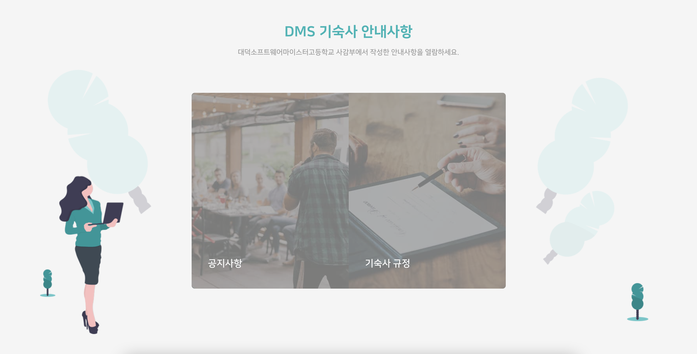
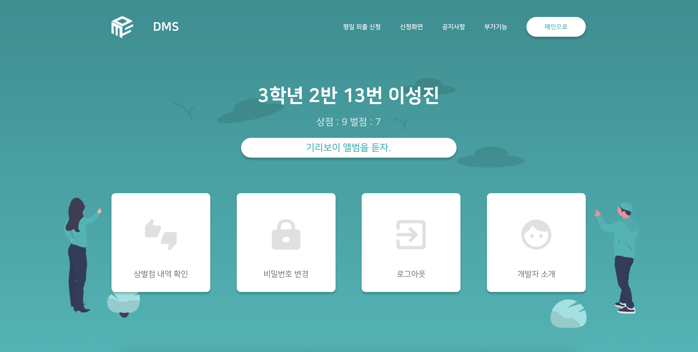

# DMS-Front-V3

DMS(dormitory Management System)란 대덕소프트웨어마이스터고등학교 기숙사 편의 생활을 위한 온라인 기숙사 시비스입니다.

## 스크린샷

  

    대덕소프트웨어마이스터고등학교 기숙사 편의 기능을 개발해 제공하는 서비스입니다.
  

  

  

    오늘의 급식표를 볼 수 있는 메인 페이지입니다.
  

  

  

    연장학습신청, 외출신청, 잔류신청, 기상음악신청 등 기숙사 내에서 신청하는 모든 것을 담당하는 신청 페이지입니다.
  

  

  

    기숙사 안내사항을 확인할 수 있는 공지사항 페이지입니다.
  

  

  

    설문조사, 버그신고, 시설물 고장 신고 등 부가기능을 소개하는 부가기능 소개 페이지입니다. 
  

  

  

    상벌점 내역, 비밀번호 변경, 로그아웃 등 자기 정보를 확인할 수 있는 마이페이지입니다.
  

  

## Technical Stack

### Software Stack

- React
- Scss
- Redux

### CI/CD

- AWS S3

### How to build and deploy ?

- aws cli 설치 후
- `aws configure --profile dms-front` 로 access키, secret키 notion에 있는거 입력
- yarn deploy
